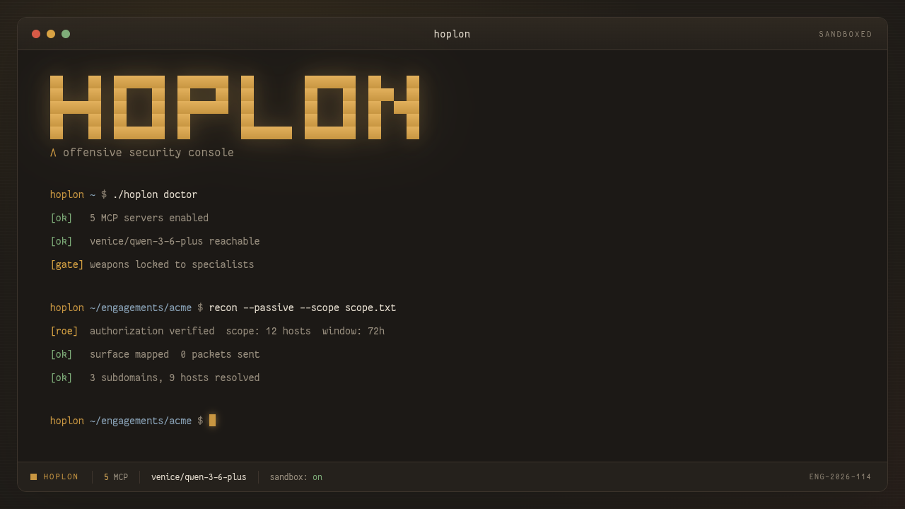
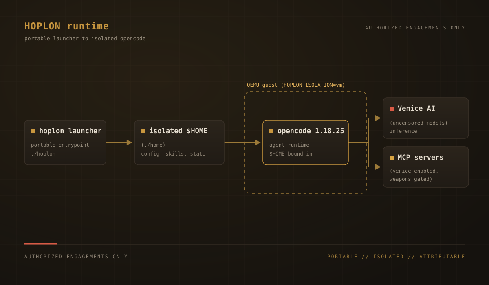

<p align="center">
  
</p>

<p align="center"><strong>A portable, uncensored red-team console on Venice AI.</strong></p>

<p align="center">
  <a href="LICENSE"></a>
  <a href="https://github.com/ShibbityShwab/hoplon/actions/workflows/ci.yml"></a>
  <a href="https://github.com/ShibbityShwab/hoplon/releases"></a>
  <a href="https://shibbityshwab.github.io/hoplon/"></a>
  <a href="CONTRIBUTING.md"></a>
</p>

Hoplon is an OpenCode distribution for authorized offensive security work. It runs every request on Venice AI's uncensored model family, carries a red-team agent roster and a rules-of-engagement gate, and keeps its entire runtime inside the repository. Clone it, run the installer, set one API key, and run.

## Why Hoplon

| | |
| --- | --- |
| **Venice only, uncensored** | `provider.venice.whitelist` allows exactly seven uncensored models. The allowlist is enforced, not a suggestion. |
| **Portable and isolated** | Its own `HOME` and all four XDG dirs live under `./home`. No host OpenCode or OMO state is read or written. |
| **Sandbox mode** | `HOPLON_SANDBOX=1` wraps the runtime in bubblewrap, hiding the host filesystem while keeping the network for the API. |
| **ROE-gated specialists** | Six red-team subagents and five offense skills, gated by a mandatory `redteam-roe` skill. |
| **Pinned MCP tooling** | Venice's official MCP server is enabled by default; every `npx` and `uvx` server is version-pinned. |
| **Reproducible** | A shell test suite and CI cover the config, the launcher, and the no-dash rule. |

## Quickstart

Install with one command:

```bash
git clone https://github.com/ShibbityShwab/hoplon.git hoplon
cd hoplon
scripts/install.sh      # fetch opencode and link the `hoplon` command
cp .env.example .env    # then set VENICE_API_KEY
hoplon
```

`scripts/install.sh` fetches the pinned opencode binary into `bin/`, then links
the `hoplon` launcher onto your `PATH` at `$HOME/.local/bin/hoplon`. Override the
link location with `HOPLON_BIN_DIR`. If that directory is not on your `PATH`, the
installer prints the exact `export PATH=...` line to add to your shell rc.

From then on the launcher is just `hoplon`, from any directory:

```bash
hoplon                   # start the TUI in the current directory
hoplon /path/to/project  # work in another project directory
hoplon doctor            # report what this box can actually do
hoplon version           # print the Hoplon and opencode versions
hoplon update            # pull Hoplon and re-fetch the runtime in place
```

`hoplon <directory>` passes the directory to OpenCode as its project, so you can
point Hoplon at any repo without changing your own working directory first.

Run `hoplon doctor` first on a new box to see what the environment can actually
do.

### Toggles

Set these in `.env` (the launcher sources it) or in the environment:

| Variable | Effect |
| --- | --- |
| `HOPLON_ENABLE_OMO=0` | run plain OpenCode; drops the OMO plugin and its takeover |
| `HOPLON_SANDBOX=1` | wrap the runtime in bubblewrap, hiding the host filesystem while keeping the network |
| `HOPLON_BIN_DIR` | where `scripts/install.sh` links the `hoplon` command |
| `HOPLON_OPENCODE_VERSION` | opencode release to fetch; `latest` tracks the newest |

<p align="center">
  
</p>

<p align="center"><em>The Hoplon TUI: the bronze-on-iron <code>hoplon</code> theme with the HOPLON home banner.</em></p>

<p align="center">
  
</p>

<p align="center"><em>How a launch flows: the launcher seeds an isolated home, then hands off to OpenCode on Venice.</em></p>

## What you get

| Component | What it is |
| --- | --- |
| **Launcher** | The `hoplon` command isolates `HOME` and XDG, seeds config, and handles the OMO host-config conflict. |
| **Harness** | Oh My OpenAgent (OMO) supplies agent and category routing, background tasks, and team mode. Optional; see below. |
| **Models** | Seven allowlisted Venice uncensored models, routed per agent and category. |
| **Sandbox** | Optional bubblewrap isolation via `HOPLON_SANDBOX=1`. |
| **Skills** | Five red-team skills plus 20 vendored Venice API skills. |
| **MCP** | Venice's MCP server on by default; recon and weapon servers present but off until enabled. |

## Documentation

- [Docs site](https://shibbityshwab.github.io/hoplon/)
- [Getting started](docs/getting-started.md)
- [Installation](docs/installation.md)
- [Sandbox](docs/sandbox.md)
- [Models](docs/models.md)
- [MCP servers](docs/mcp-servers.md)
- [Rules of engagement](docs/rules-of-engagement.md)

For the full walkthrough, offline and portability notes, and hardening detail, start at the docs site. To verify any claim in this README, see [CONTRIBUTING.md](CONTRIBUTING.md).

## The harness and its license

Hoplon loads the Oh My OpenAgent (OMO) plugin as its routing layer, but OMO is not part of Hoplon and is not OSI open source. It is distributed under the Sustainable Use License (SUL-1.0), a source-available license with use restrictions, and it is fetched at runtime rather than vendored here. Set `HOPLON_ENABLE_OMO=0` in `.env` to run plain OpenCode on Venice without it. See [THIRD_PARTY_NOTICES.md](THIRD_PARTY_NOTICES.md) for the full component list.

## Philosophy

**Freedom should be free.** Hoplon is open source, sends no telemetry of its own, and puts no gatekeeper between you and the model. **Credit where due.** It is a distribution, not a from-scratch agent, and every upstream component is named in [THIRD_PARTY_NOTICES.md](THIRD_PARTY_NOTICES.md). **This is an opinionated build.** Venice only, uncensored only, YOLO permissions by default, and it says so.

## Security

Report vulnerabilities per [SECURITY.md](SECURITY.md).

## License

Hoplon's own code is licensed under the GNU Affero General Public License v3.0 or later (AGPL-3.0-or-later). See [LICENSE](LICENSE) and [NOTICE](NOTICE). Third-party components keep their own licenses; see [THIRD_PARTY_NOTICES.md](THIRD_PARTY_NOTICES.md).
