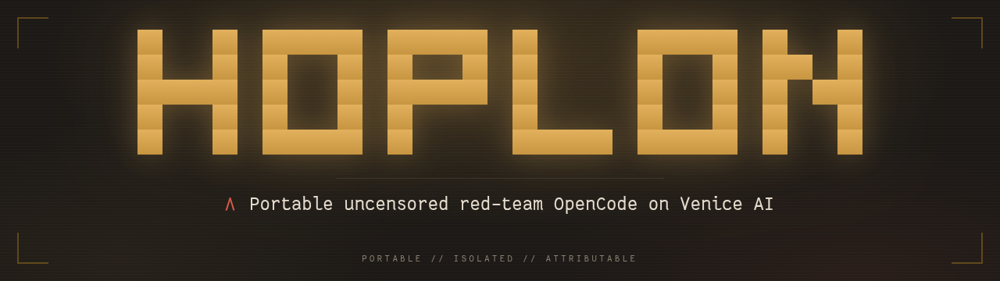

# Hoplon



An uncensored, red-team-focused OpenCode distribution that runs on Venice AI and
carries the Oh My OpenAgent harness. Clone the repo, install the binary, set one
API key, and you have a portable security console that keeps all of its state
inside its own tree.

## Quickstart

```bash
git clone https://github.com/ShibbityShwab/hoplon.git hoplon
cd hoplon
scripts/install.sh
cp .env.example .env     # then set VENICE_API_KEY
./hoplon doctor
./hoplon
```

## What you get

- **Venice AI only.** Every route points at Venice's uncensored model family, with no platform-level content filter.
- **Isolated by default.** The launcher keeps `HOME` and every XDG directory inside `./home`, so the host stays untouched.
- **Optional sandbox.** `HOPLON_SANDBOX=1` wraps the runtime in bubblewrap with the network up for Venice and the host filesystem hidden.
- **Red-team roster.** Six specialist agents and five offense skills, gated by a mandatory rules-of-engagement skill.
- **Venice-native tools.** A 31-tool MCP server plus 20 official Venice API skills for embeddings, image, video, audio, music, and characters.
- **No telemetry.** Autoupdate and PostHog telemetry are disabled, so a portable copy stays frozen and quiet.

## Explore the docs

- [Installation](installation.md) for the full setup walkthrough.
- [Getting started](getting-started.md) for the first-session tour.
- [Configuration](configuration.md) for agents, permissions, and MCP servers.
- [Models](models.md) for the allowlisted roster and limits.
- [MCP servers](mcp-servers.md) to enable recon and weapon servers.
- [Sandbox](sandbox.md) and [Isolation](isolation.md) for the security model.
- [Rules of engagement](rules-of-engagement.md) before any active testing.
- [OMO](omo.md) for the harness that routes agents and categories.
- [Architecture](architecture.md) for how the pieces fit together.
- [Security](security.md) for the threat model and hardening notes.
- [Troubleshooting](troubleshooting.md) when something does not start.
- [FAQ](faq.md) for common questions.

## License

Hoplon is released under the
[GNU Affero General Public License v3.0 or later](https://www.gnu.org/licenses/agpl-3.0.html)
(AGPL-3.0-or-later).
